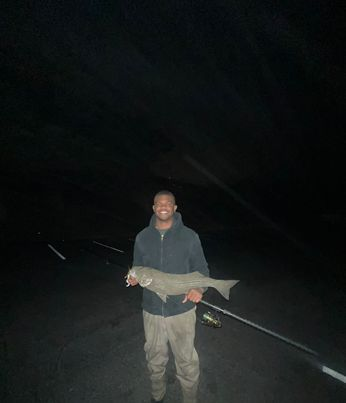
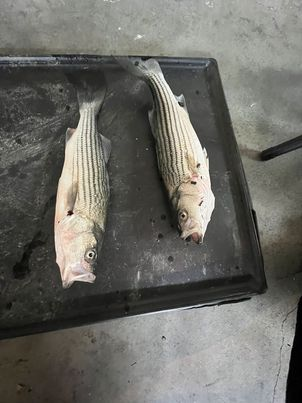
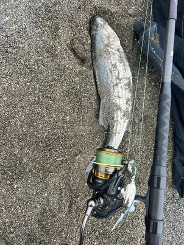
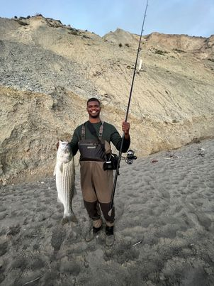
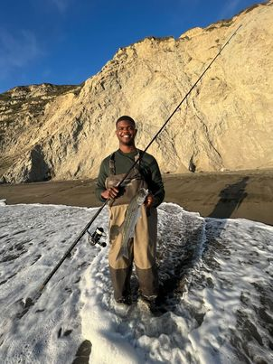
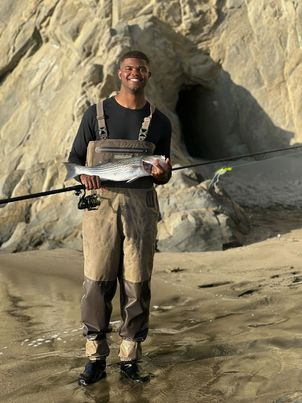
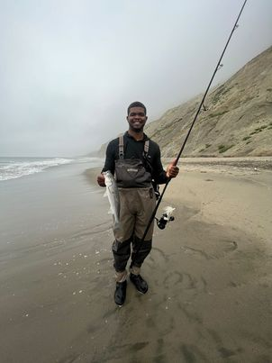

## Fishing Log
The inspiration behind my fishing log largely comes from John Skinner and his book: "Fishing the bucktail", which covers fishing applications from surf, kayak, boat and bays. 

Gear
---
Rod: 
- 9 ft medium heavy St.Croix Mojo Surf Rod

  
Reel:
- Van Stall Vr 125

  
Lures: 
- 3/4 - 2 oz fixed hook bucktails topped with a white 5-1/2 inch bait strip by fat cow jig strips
- Super Strike Little neck popper 2-3/4 bone color (black eye)
- pencil popper


Equiptment:
- fishing bag with leader wallet
- Headlight 
---

```
30 inch striper
3/4 oz bucktail (green hair/ brown head/ orange feathers / white bait strip)
Rockaway beach
```

---


```
22 inch Striper
21 inch Striper
1 oz bucktail (green hair/ brown head/ orange feathers / white bait strip)
Rockaway beach
- first fish bit in the lip
- second fish bit in a trouph, I dragged the bucktail parallel to the shore
```


---


```
20 inch Striper
1.5 oz bucktail (blue and white hair/ blue head/ no feathers / white bait strip)
Sharp Beach (Pacifica)
- bucktail was dragging most of the time
- rough surf
- fish was caught along the beach lip (bit in a wave)
```


---

```
21 inch Striper
1 oz bucktail (white/ no feathers/ white bait strip)
Mussel Rock beach
- found a good weight, swam the bucktail through the water, bit kind of far out
- mediuim surf

34 inch Striper
2-3/8 Super Strike Popper (black eye/bone color)
- medium retrieve, sharp pump every few cranks
- fish bit far out, after I timed a nice wave breaking
```



---

```
19 inch Striper
1 oz bucktail (chartruese and white/ white feathers/ white bait strip)
Mussel Rock beach
- found a good weight, swam the bucktail through the water, calm surf
```

---
```
20 inch Striper
1 oz bucktail (white/ no feathers/ white bait strip)
Mussel Rock beach
- found a good weight, swam the bucktail through the water
- mediuim surf
```

---
